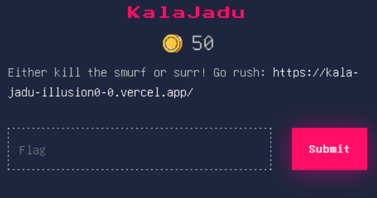
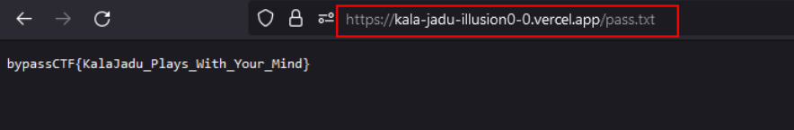
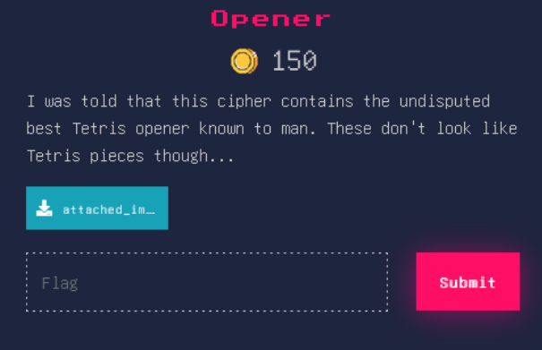
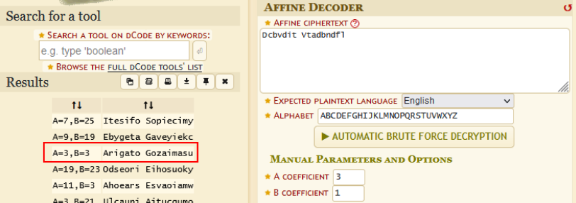
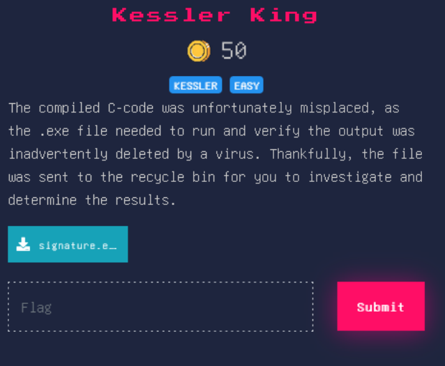
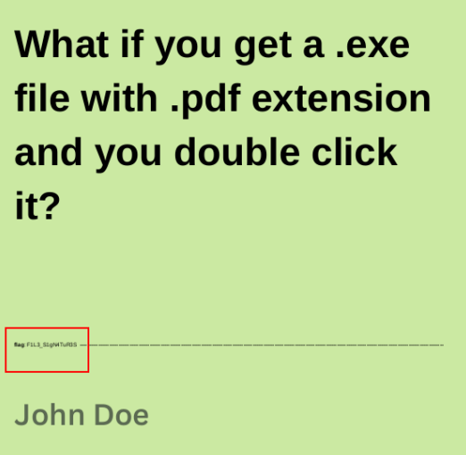
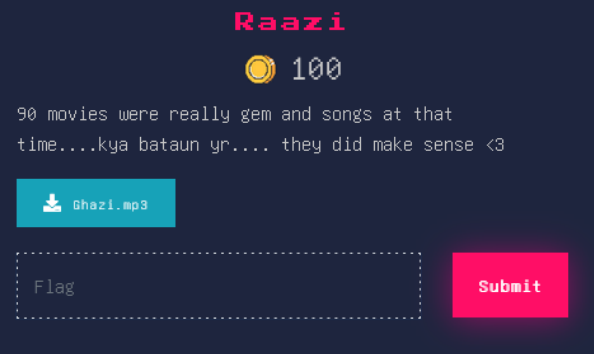
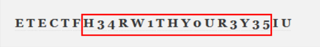
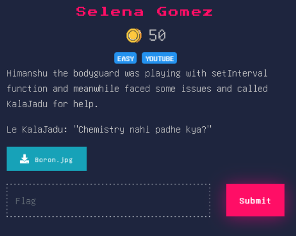
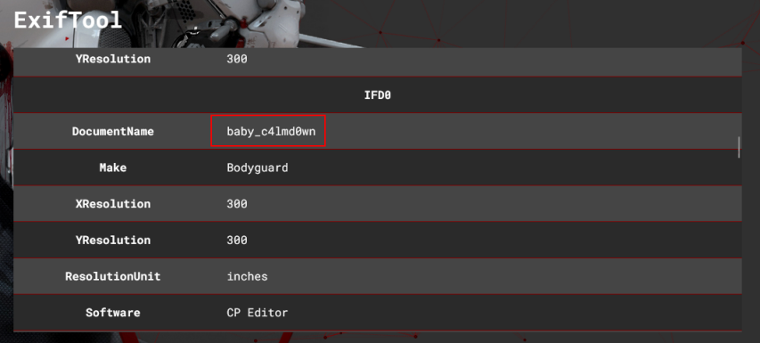

# ByPassCTF-2023

Information Security & Digital Forensics Club (ISDF) of the Army Institute of Technology organized 'Bypass CTF', a 24-hour Capture-the-Flag competition with challenges in categories such as Web, OSINT, Crypto, and more. Compete solo in a challenging and rewarding competition to demonstrate your cybersecurity expertise. Below are the writeup of the challenges that I had solved.

## MISC
### nOOb


```ruby
FLAG : bypassCTF{zakhme_dil_chupake_royenge}
```

## WEB
### KalaJadu


- Checking the website led us to a login page. I decided to analyze the code of the page and saw a  `stealcred.php` code. The code basically was storing all the creds in `pass.txt` file. 



```ruby
FLAG : bypassCTF{KalaJadu_Plays_With_Your_Mind}
```


## CRYPTO
### Opener


- The attached image had the pigpen cipher. Decoding it gave the flag.
![[/images/Opener-2.png]]

```ruby
FLAG : ByPassCTF{HACHISPIN_TO_WIN}
```


### Secret Transmission


- The name "Affine" and "Thank you" gave an idea that it is in Affine cipher and thus decoding it gave the Japanese for "Thank You"



```ruby
FLAG : ByPassCTF{Arigato_Gozaimasu}
```


## FORENSICS
### Kessler King


- After downloading the file I decided to check it's strings and got something in the output.

```ruby
┌──(kali㉿kali)-[~/Desktop]
└─$ strings signature.exe 
%PDF-1.4
1 0 obj
/Type /Catalog
/Version /1.4
/Pages 2 0 R
/ViewerPreferences 3 0 R
/Lang (en)
endobj
4 0 obj
/Keywords (DAFgAOUMc4Q,BAEcGx0gvXY)
/Author (John Doe)
/Creator (Canva)
/Producer (Canva)
/Title (What if you get a .exe file with .pdf extension and you double click it?)
/CreationDate (D:20230413161122+00'00')
endobj
2 0 obj
/Type /Pages
/Kids [5 0 R]
/Count 1
endobj
3 0 obj
.
.
.
</snip>
```

`What if you get a .exe file with .pdf extension and you double click it?`
- Decided to change the extension to .pdf and got the flag



```ruby
FLAG : ByPassCTF{F1L3_S1gN4TuR3S}
```


### Raazi


- The challenge had an audio file attached with it. There was a morse code in between.


```ruby
bypassCTF{H34RW1THY0UR3Y35}
```


### Selena Gomez


- Started with the basic enumeration i.e checking it's metadata, strings, hex, etc. 
- Found the flag in the metadata.



```ruby
FLAG : ByPassCTF{baby_c4lmd0wn}
```


## OSINT
### Snowstorm
The osint challenge stated about a painting purchased about a person and the emotion connected to it. There was an image attached of a white wall. Looking at the image after searching a lot I got a clue that the reference of the painting is from a Netflix show Daredevil. In the season 1 of the show there was a mention of a person name Wilson Fisk buying a painting and the emotion love attached to it.

```ruby
FLAG : bypassCTF{wilsonfisk_love}
```
